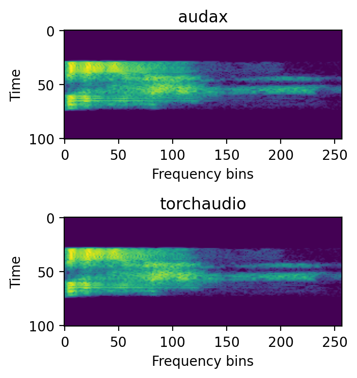

# audax
- [Sponsors](#sponsors)
- [About](#about)
- [Installation](#installation)
  - [Requirements](#requirements)
- [Data pipeline](#data-pipeline)
- [What's available](#whats-available)
  - [Audio feature extraction](#audio-feature-extraction)
  - [Network architectures](#network-architectures)
  - [Learnable Frontends](#learnable-frontends)
  - [Self-supervised models](#self-supervised-models)
- [What's coming up](#whats-coming-up)
- [On contributing](#on-contributing)
- [References](#references)

## Sponsors
This work would not be possible without cloud resources provided by Google's [TPU Research Cloud (TRC) program](https://sites.research.google/trc/about/). I also thank the TRC support team for quickly resolving whatever issues I had: you're awesome!

Want to become a sponsor? Feel free to reach out!

## About
A home for audio ML in [JAX](https://jax.readthedocs.io/en/latest/). Has common features, popular learnable frontends, and pretrained supervised and self-supervised models.
As opposed to popular frameworks, the objective is not to become an end-to-end, end-all-be-all DL framework, but instead to act as a starting point for doing things the jax way, through reference implementations and recipes, using the [jax](https://jax.readthedocs.io/en/latest/) / [flax](https://flax.readthedocs.io/en/latest) / [optax](https://optax.readthedocs.io/en/latest/) stack.

**PS:** I'm quite new to using Jax and it's functional-at-heart design, so I admit the code can be a bit untidy at places. 
Expect changes, restructuring, and like the official Jax repository itself says, sharp edges!

## Installation

### Requirements
```
jax
flax>=0.4.0
optax==0.1.1
tensorflow>=2.7.0
tensorflow-datasets
tensorflow-io   # for audio decoding
```

After installing prerequisites, to install audax
```shell
git clone https://github.com/SarthakYadav/audax.git
cd audax
pip install .
```

## Data pipeline

- All training is done on custom TFRecords. Initially tried using [tensorflow-datasets](https://www.tensorflow.org/datasets/api_docs/python/tfds), but decided against it.
- tfrecords comprise of examples with audio file stored as an encoded `PCM_16` `flac` buffer, label info and duration, resulting in smaller `tfrecord` files and faster I/O as compared to storing audio as a sequence of floats. 
- A step-by-step guide to setup data can be found in the [recipes/data_prep](recipes/data_prep/README.md), including sample script to convert data into tfrecords.
- More info could be found in [audax.training_utils.data_v2](audax/training_utils/data_v2)

## What's available

### Audio feature extraction

At the time of writing, `jax.signal` does not have a native Short-time Fourier Transform (`stft`) implementation.

Instead of trying to emulate the `scipy.signal` implementation that has a lot more bells and whistles and is more feature packed,
the `stft` implementation in `audax.core` is designed such that it can be build upon to extract `spectrogram` and `melspectrogram` features 
as those found in [torchaudio](https://pytorch.org/audio/stable/functional.html), which are quite popular. 
The result is a simple implementation of `stft`, `spectrogram` and `melspectrogram`, which are compatible with their torchaudio counterparts, as shown in the figure below.



Currently, `spectrogram` and `melspectrogram` features are supported. Visit [audax.core.readme](audax/core/README.md) for more info.

Apart from features, jax.vmap compatible [mixup](https://arxiv.org/abs/1710.09412) and [SpecAugment](https://arxiv.org/abs/1904.08779) (no TimeStretch as of now unfortunately) implementations are also provided. 

### Network architectures
Several prominent neural network architecture reference implementations are provided, with more to come. The current release has:
- [ResNets](audax/models/resnet.py) [1]
- [EfficientNet](audax/models/efficientnet.py) [2]
- [ConvNeXT](audax/models/convnext.py) [3]

Pretrained models can be found in respective [recipes](recipes), and expect more to be added soon.

### Learnable frontends
Two popular learnable feature extraction frontends are available in [audax.frontends](audax/frontends) `LEAF` [4] and `SincNet` [5].
Sample recipes, as well as pretrained models ([AudioSet](https://research.google.com/audioset/) for now) can be found in the [recipes/leaf](recipes/leaf).

### Self-supervised models
- Pretrained `COLA` [6] models on AudioSet for various aforementioned architectures can be found in [recipes/cola](recipes/cola). 
- A working implementation of `SimCLR` [7, 8] can be found in [recipes/simclr](recipes/simclr), and pretrained models will be added soon (experiments ongoing!).

## What's coming up
- Better documentation and walk-throughs.
- Pretrained `SimCLR` models.
- Recipes for Speaker Recognition on [VoxCeleb](https://www.robots.ox.ac.uk/~vgg/data/voxceleb/)
- More `AudioSet` pretrained checkpoints for architectures already added.
- Reference implementations for more neural architectures, esp. Transformer based networks.
- PyPi release (soon!)

## On contributing
- At the time of writing, I've been the sole person involved in development of this work, and quite frankly, would love to have help!
- Happy to hear from open source contributore, both newbies and experienced, about their experience and needs
- Always open to hearing about possible ways to clean up/better structure code.

## References

[1] He, K., Zhang, X., Ren, S. and Sun, J., 2016. Deep residual learning for image recognition. In Proceedings of the IEEE conference on computer vision and pattern recognition (pp. 770-778).  
[2] Tan, M. and Le, Q., 2019, May. Efficientnet: Rethinking model scaling for convolutional neural networks. In International conference on machine learning (pp. 6105-6114). PMLR.    
[3] Liu, Z., Mao, H., Wu, C.Y., Feichtenhofer, C., Darrell, T. and Xie, S., 2022. A ConvNet for the 2020s. arXiv preprint arXiv:2201.03545.  
[4] Zeghidour, H., Teboul, O., Quitry, F., and Tagliasacchi, M., LEAF: A Learnable Frontend for Audio Classification, In International Conference on Learning Representations, 2021.  
[5] Ravanelli, M. and Bengio, Y., 2018, December. Speaker recognition from raw waveform with sincnet. In 2018 IEEE Spoken Language Technology Workshop (SLT) (pp. 1021-1028). IEEE.  
[6] Saeed, A., Grangier, D. and Zeghidour, N., 2021, June. Contrastive learning of general-purpose audio representations. In ICASSP 2021-2021 IEEE International Conference on Acoustics, Speech and Signal Processing (ICASSP) (pp. 3875-3879). IEEE.  
[7] Chen, T., Kornblith, S., Norouzi, M. and Hinton, G., 2020, November. A simple framework for contrastive learning of visual representations. In International conference on machine learning (pp. 1597-1607). PMLR.    